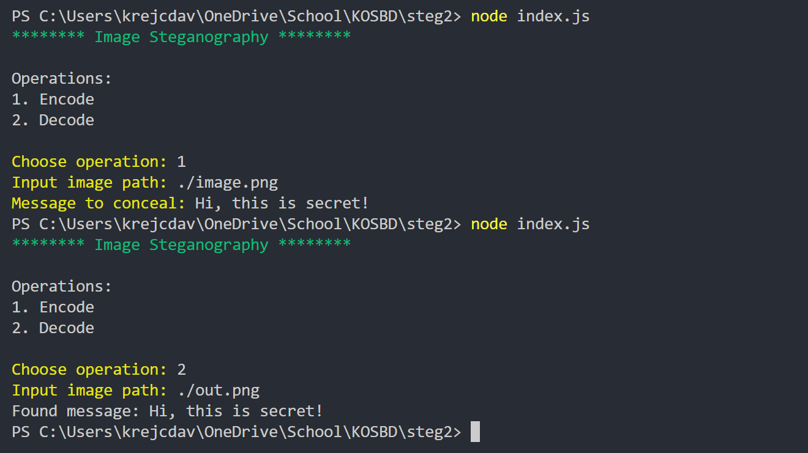

# js-steganography

Image steganography (https://en.wikipedia.org/wiki/Steganography) implemented using JavaScript. Hide secret messages in your images!

# Running

First make sure you have node.js and npm installed (https://nodejs.org/en/), then:

Install dependecies using `npm install`
and run program using `node index.js`

